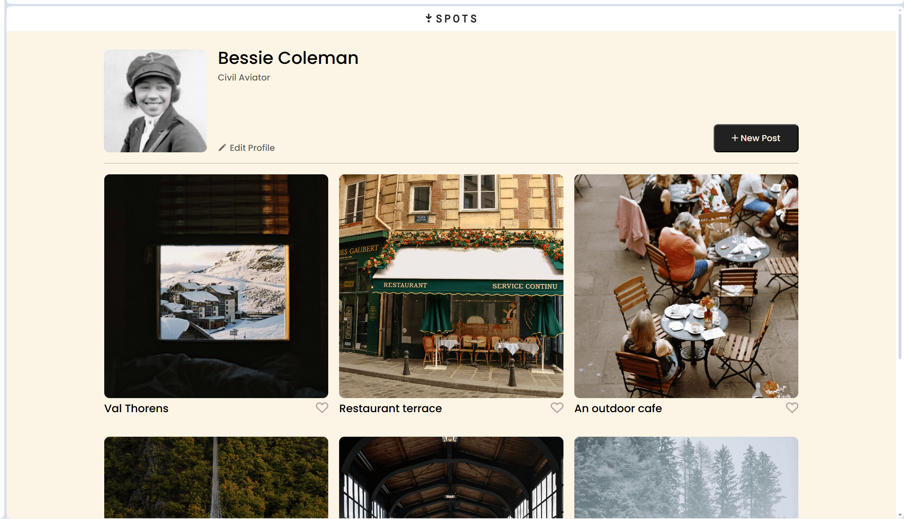
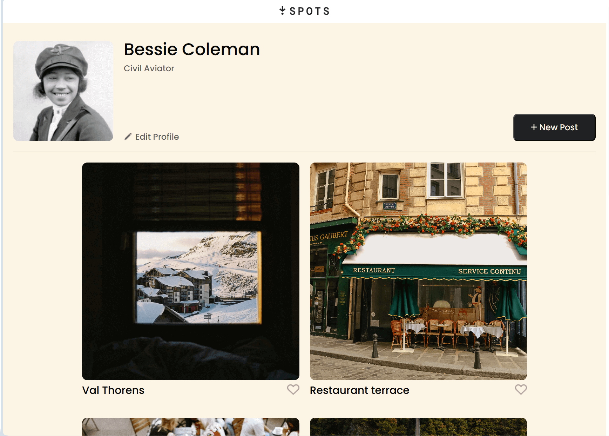
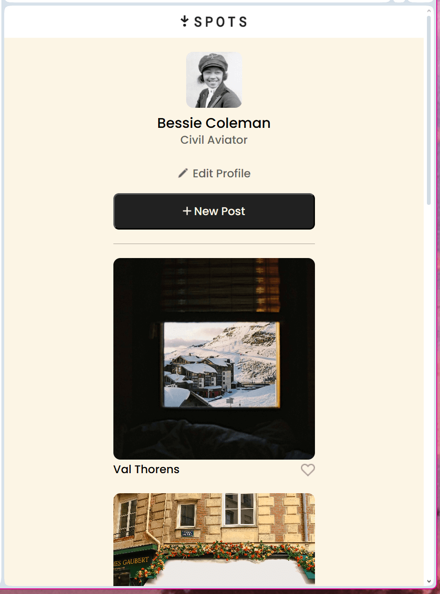

# Project 3: Spots

_Overview_

Spots is an online image gallery for artists to share their work.

## Project Features

- BEM File Structure
- Hover States
- Pointer Cursor
- Flex Box
- Grid Box
- Text Overflow
- Media Queries

### Summery

This project, that I have named _Ariel's Grotto_, is an image sharing website for both professionals and non-professionals. It was created by following a Figma draft and was designed to work on:

_big screens_

_medium screens_

_small screens_

The website should flow from one size to another seemlessly.

- **Future plans**

- working inputs
- like button animation
- search function

#### Wrap-up

Thank you for your interest in my project. Please be sure to vist the website [here!](https://sugarspunstars.github.io/se_project_spots/)

#### Project Pitch Video

Please check out my [Pitch Video](https://drive.google.com/file/d/121MGvqlsX-v5UxTF7cwV_mSzlaX6IafZ/view?usp=sharing), where I talk more about my project and some challenges I faced while building it!
